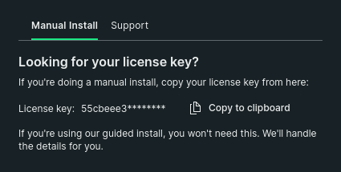
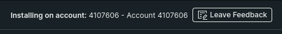

# Detailed installation instructions
Here are the excruciatingly step-by-step instructions for installing Data Driven Dave. These instructions are largely \*nix specific (which usually includes MacOS but I've inlcuded some MacOS specific steps. However, as always YMMV).

First, the github repo is https://github.com/devreldragon/data-driven-dave

## STEP 1: Ensuring python and pip are installed. 
### First check Python: 
Open a terminal window and type:
`python3 --version`

### Next check Pip: 
In that terman, type:
`pip --version`

or possibly

`python3 -m pip --version`


NOTE: pip might be installed but not in your path. 

If either python3 or pip isn't present, install it using instructions appropriate to your operating system. 

## STEP 2: (optional but a good idea: Install the python virtual environment (venv)
This step is optional, but ensures your python modules and versions aren't stomping all over each other.

`sudo pip install virtualenv`

## STEP 3: Install git.

It should already be installed, so first test whether it's present by typing:
`git --version`

If it's not installed, you SHOULD get a prompt to install it on MacOS. On Linux, you can use your package manager. Examples:
`sudo dnf install git-all`
or 
`sudo apt install git-all`

## STEP 4: Install data-driven-dave:
Make a directory for the github repo
`mkdir datadrivendave`

Change into that directory
`cd datadrivendave`

Clone the repo:
`git clone git@github.com:devreldragon/data-driven-dave`


## STEP 5: Create the virtual environment and install the modules you'll need:
First, we'll initialize virtualenv in this directory (so be in the terminal, in the data-driven-dave repo directory, and type):
`python3 -m venv venv`

Now activate virtualenv:
`source venv/bin/activate`

You'll see a (venv) at the front of your commandline now.
NOTE: to de-activate virtualenv, type `deactivate` all by itself.
ANOTHER NOTE: to re-start venv, type `source venv/bin/activate` again.

Now (with Virtualenv / "venv" enabled) you can install the python modules in this virtual environment, and they won't conflict with any other python environments you might have on the machine:

You can install them one at a time:
```
pip install pygame
pip install newrelic
```

or you can use the included requirements.txt file to do it:
`pip install -r requirements.txt`

NOTE: Sometimes folks encounter issues with this step. See "Troubleshooting" below for hints and ideas. 

## STEP 6: Modify two game files
NOW we're going to:
  1) update newrelic.ini with your API key
  2) update game_stats.json (in MULTIPLE PLACES) with your New Relic ID.

### Get ID and API key
Let's start by getting your account ID and your ingest API key. 
 - Log into your New Relic account
   - If this is your first time connecting, you'll get the "Tell Us About Your Stack" screen. 
 - Select Python and then click "continue"
 - To skip installing the infrastructure agent, click the (verrrry tiny) "don't have access to host" link.
 - In the upper right corner of this screen, find the part that says "Manual Install", and then the "Copy to Clipboard" option next to your license key.
 	- Copy your license key and save it somewhere.

 	


 - Click the Python tile
 - In the upper right corner of THIS screen you'll see your ID. Copy *that* down and save it somewhere.




***NOTE: STAY ON THIS SCREEN IN one.newrelic.com, BUT PROCEED WITH THE STEPS BELOW***

### Update newrelic.ini
 - Open the file newrelic.ini
 - Find the line that reads "license_key = INSERT_YOUR_INGEST_LICENSE_KEY_HERE"
   - (it should be around line 33)
 - Edit it so it uses your API key from the previous step.
 
 Save the file and continue.

### Update game_stats.json
 - open the file game_stats.json
 - Edit ***EVERY*** occurrence of YOUR_ACCOUNT_ID
 - Replace it with your Account ID.
 
 NOTE: There are EIGHT (8) occurrences, around lines 45, 74, 101, 130, 165, 226, 290, and 319

Save the file and continue.

## Step 7: Play the game
You have to play the game (just a little) so data starts flowing into New Relic and you can get past the installer screen. 

(Make sure you're running the virtual environment, as described above)
 - Use the command: `python3 main_fun.py`
 - hit space to start the game
 - move around a big. Grab one of those ball things. Maybe even the golden cup/chalice/trophy. 
 
## Step 8: Return to One.NewRelic.com
 - Enter a name for your demo. It can be anything. Then click "Save"
 - We've effectively done everything on this screen, so you can scroll to the bottom and click "Continue"
 - We don't need to enable logging for this demo, so click "Skip"
 - Click "Test Connection"

If you've played the game, there should be data and you'll see "Installed" next to the Python agent. Then you can click continue. 

Click "See Your Data"

Congratulations! You now have an application called "Data Driven Dave"! Now we just need to import the dashboard. 

## Step 8: Import your dashboard into New Relic. 
This creates the data driven dave dashboard connected to your machine/game. 

PLEASE NOTE: you have to manually create a blank dashboard BEFORE the "import dashboard" option will appear. This is an issue with our current platform where the "import dashboard" option isn't available until AFTER you have one dashboard in your inventory.

### Create a blank dashboard
First, you have to create a blank dashboard because of an existing issue in the New Relic platform (we're fixing it. We promise.)
 - On the left-hand menu, click "Dashboards"
 - Click "Create your first dashboard"
 - give it a name
 - Click "Create"

Now you can import the data driven dave dashboard:
 - On the left-hand menu, click "Dashboards" (yes, again)
 - In the upper right corner you'll see "Import Dashboard". Click it.
 - In the next screen, past the contents of game_stats.json

 IF you've updated all 8 of the account ID spots, you'll see the "Import Dashboard" button light up. Click it.


## TAKE A MOMENT TO CELEBRATE
It's important to recognize the small victories in life. You just cloned a repo, set up python, set up a new New Relic account, instrumented an application, and created a dashboard. You should feel proud!

Now, if you start playing the Data Driven Dave game, you'll see this dashboard light up with stats, numbers, and more. 

## Troubleshooting
Most of the issues we've seen come down to the following:

### python or pip not installing
If you can't run `pip install`, try the following variations and see if the error messages give you any deeper understanding of what's not working:
 - pip3 install
 - python3-pip install
 - python3 -m pip install

### Can't create/save the dashboard when importing
This is almost certainly because you missed updating one of the "YOUR_ACCOUNT_ID" markers in game_stats.json. 

### Stats not updating on the dashboard
Note that some stats update in realtime, while others aren't collected until gameplay finishes (hitting esc or using up all your lives and going back to the intro screen). Broadly speaking, collected items, along with machine information, is collected and updated constantly, while game stats (level achieved, number of games played, high score) are only updated once gameplay finishes.


